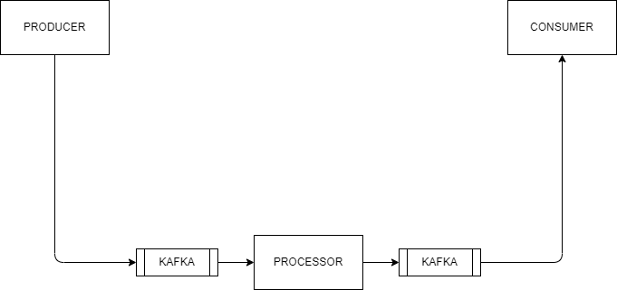

# Spring Cloud Stream
- it is a binding framework, which binds your code to the destination.
- spring cloud stream is a framework for building highly scalable event-driven microservices connected 
with shared messaging system like Kafka, RabbitMQ, Google PubSub.
- we can produces/process/consume data stream with any message broker (Kafka/RabbitMQ) without much 
configuration.

